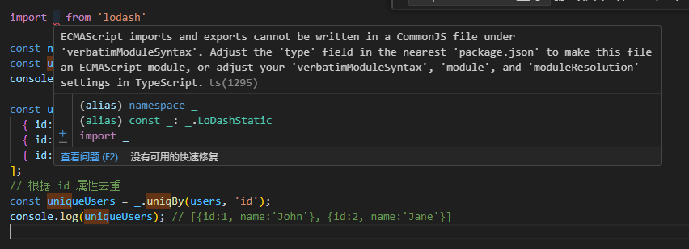
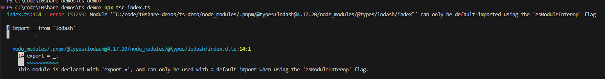

npm init -y
pnpm add typescript -D
npm install typescript -D
npx tsc --init

// tsconfig.json

{
  // Visit https://aka.ms/tsconfig to read more about this file
  "compilerOptions": {
    // File Layout
    // "rootDir": "./src",
    // "outDir": "./dist",

    // Environment Settings
    // See also https://aka.ms/tsconfig/module
    "module": "nodenext",
    "target": "esnext",
    "types": [],
    // For nodejs:
    // "lib": ["esnext"],
    // "types": ["node"],
    // and npm install -D @types/node

    // Other Outputs
    "sourceMap": true,
    "declaration": true,
    "declarationMap": true,

    // Stricter Typechecking Options
    "noUncheckedIndexedAccess": true,
    "exactOptionalPropertyTypes": true,

    // Style Options
    // "noImplicitReturns": true,
    // "noImplicitOverride": true,
    // "noUnusedLocals": true,
    // "noUnusedParameters": true,
    // "noFallthroughCasesInSwitch": true,
    // "noPropertyAccessFromIndexSignature": true,

    // Recommended Options
    "strict": true,
    "jsx": "react-jsx",
    "verbatimModuleSyntax": true,
    "isolatedModules": true,
    "noUncheckedSideEffectImports": true,
    "moduleDetection": "force",
    "skipLibCheck": true,
  }
}

pnpm add lodash -D
npm install loadash -D
// index.ts

import _ from 'lodash'

const numbers = [1, 2, 2, 3, 4, 4, 5];
const uniqueNumbers = _.uniq(numbers);
console.log(uniqueNumbers); // [1, 2, 3, 4, 5]

const users = [
  { id: 1, name: 'John' },
  { id: 2, name: 'Jane' },
  { id: 1, name: 'Johnny' } // 重复的 ID
];
// 根据 id 属性去重
const uniqueUsers = _.uniqBy(users, 'id');
console.log(uniqueUsers); // [{id:1, name:'John'}, {id:2, name:'Jane'}]
// issue

ECMAScript imports and exports cannot be written in a CommonJS file under 'verbatimModuleSyntax'. Adjust the 'type' field in the nearest 'package.json' to make this file an ECMAScript module, or adjust your 'verbatimModuleSyntax', 'module', and 'moduleResolution' settings in TypeScript.ts(1295)

// package.json

{
  //...
  "type": "module",
  //...
}
pnpm add  -D @types/node
npx tsc index.ts

// issue
Module '' can only be default-imported using the 'esModuleInterop' flag

